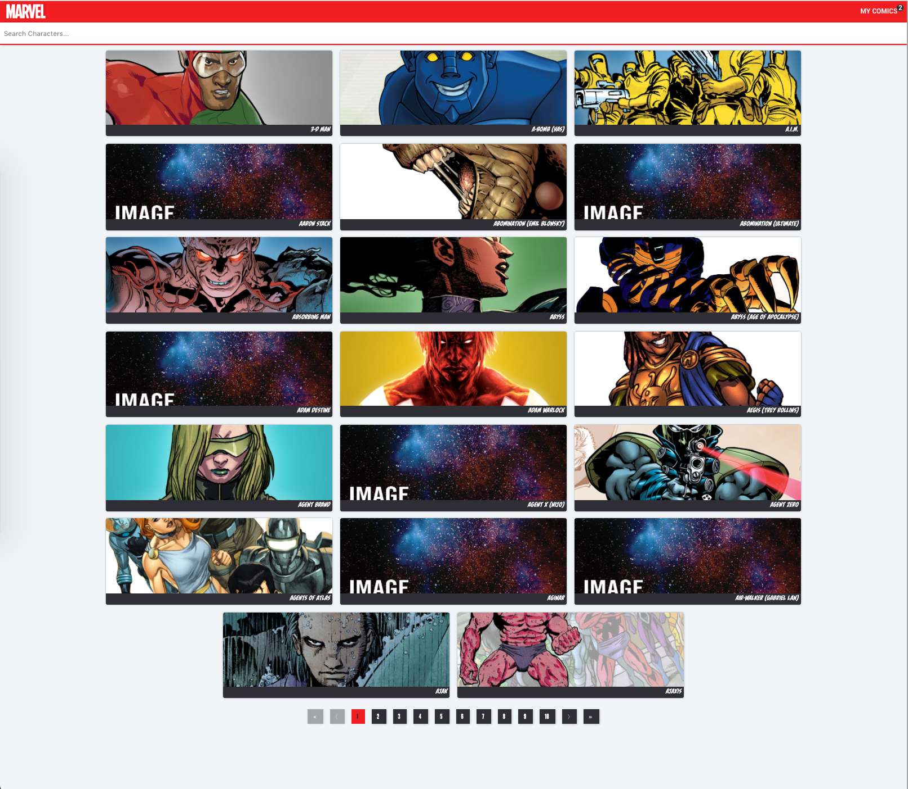
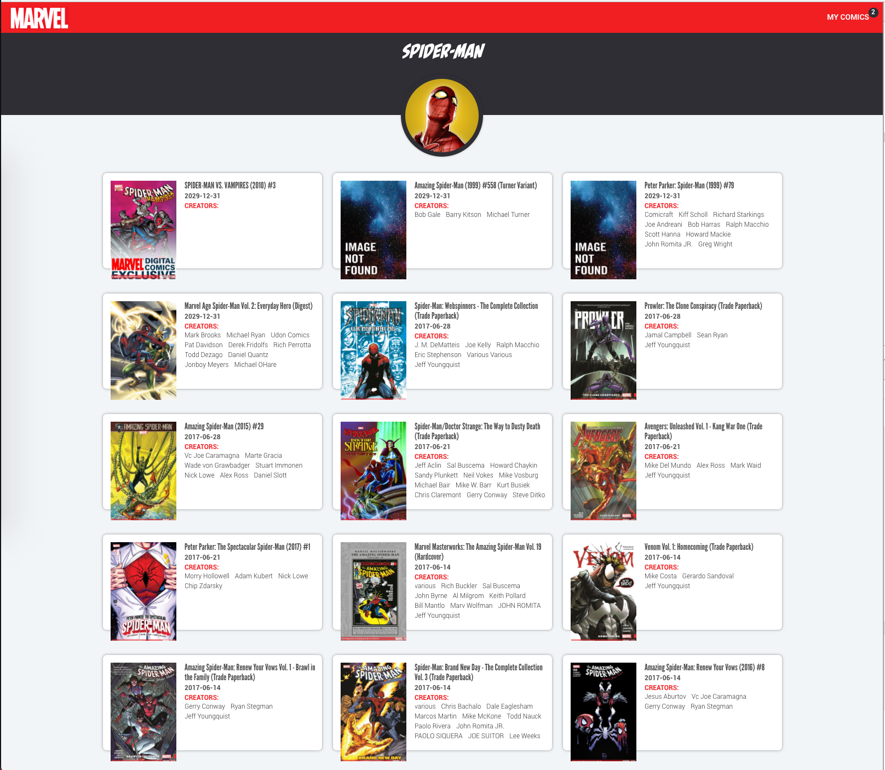

This project was bootstrapped using [React Slingshot](https://github.com/coryhouse/react-slingshot).

## Features
  Marvel character list
  
  Character list
  
  Comic detail
  
  Favorites
  

## Project Structure

```
react-marvel-comics/
  README.md
  node_modules/
  package.json
  fonts/  
  src/
    actions/
    components/
      tests/
    containers/
    reducers/
    services/
    store/
    styles/
    favicon.ico      
    index.js
    Root.js
    routes.js    

```

## Available Scripts

In the project directory, you can run:

### `npm run start`

Runs the app in the development mode.<br>
Open [http://localhost:3000](http://localhost:3000) to view it in the browser.

The page will reload if you make edits.<br>
You will also see any lint errors in the console.

### `npm run test`

Launches the test runner in the interactive watch mode.<br>


### `npm run build`

Builds the app for production to the `dist` folder.<br>
It correctly bundles React in production mode and optimizes the build for the best performance.

The build is minified and the filenames include the hashes.<br>
Your app is ready to be deployed!

## Technologies
Slingshot offers a rich development experience using the following technologies:

| **Tech** | **Description** |**Learn More**|
|----------|-------|---|
|  [React](https://facebook.github.io/react/)  |   Fast, composable client-side components.    | [Pluralsight Course](https://www.pluralsight.com/courses/react-flux-building-applications)  |
|  [Redux](http://redux.js.org) |  Enforces unidirectional data flows and immutable, hot reloadable store. Supports time-travel debugging. Lean alternative to [Facebook's Flux](https://facebook.github.io/flux/docs/overview.html).| [Getting Started with Redux](https://egghead.io/courses/getting-started-with-redux), [Building React Applications with Idiomatic Redux](https://egghead.io/courses/building-react-applications-with-idiomatic-redux), [Pluralsight Course](http://www.pluralsight.com/courses/react-redux-react-router-es6)|
|  [React Router](https://github.com/reactjs/react-router) | A complete routing library for React | [Pluralsight Course](https://www.pluralsight.com/courses/react-flux-building-applications) |
|  [Babel](http://babeljs.io) |  Compiles ES6 to ES5. Enjoy the new version of JavaScript today.     | [ES6 REPL](https://babeljs.io/repl/), [ES6 vs ES5](http://es6-features.org), [ES6 Katas](http://es6katas.org), [Pluralsight course](https://www.pluralsight.com/courses/javascript-fundamentals-es6)    |
| [Webpack](http://webpack.github.io) | Bundles npm packages and our JS into a single file. Includes hot reloading via [react-transform-hmr](https://www.npmjs.com/package/react-transform-hmr). | [Quick Webpack How-to](https://github.com/petehunt/webpack-howto) [Pluralsight Course](https://www.pluralsight.com/courses/webpack-fundamentals)|
| [Browsersync](https://www.browsersync.io/) | Lightweight development HTTP server that supports synchronized testing and debugging on multiple devices. | [Intro vid](https://www.youtube.com/watch?time_continue=1&v=heNWfzc7ufQ)|
| [Jest](https://facebook.github.io/jest/) | Automated tests with built-in expect assertions and [Enzyme](https://github.com/airbnb/enzyme) for DOM testing without a browser using Node. | [Pluralsight Course](https://www.pluralsight.com/courses/testing-javascript) |
| [TrackJS](https://trackjs.com/) | JavaScript error tracking. | [Free trial](https://my.trackjs.com/signup)|  
| [ESLint](http://eslint.org/)| Lint JS. Reports syntax and style issues. Using [eslint-plugin-react](https://github.com/yannickcr/eslint-plugin-react) for additional React specific linting rules. | |
| [SASS](http://sass-lang.com/) | Compiled CSS styles with variables, functions, and more. | [Pluralsight Course](https://www.pluralsight.com/courses/better-css)|
| [PostCSS](https://github.com/postcss/postcss) | Transform styles with JS plugins. Used to autoprefix CSS |
| [Editor Config](http://editorconfig.org) | Enforce consistent editor settings (spaces vs tabs, etc). | [IDE Plugins](http://editorconfig.org/#download) |
| [npm Scripts](https://docs.npmjs.com/misc/scripts)| Glues all this together in a handy automated build. | [Pluralsight course](https://www.pluralsight.com/courses/npm-build-tool-introduction), [Why not Gulp?](https://medium.com/@housecor/why-i-left-gulp-and-grunt-for-npm-scripts-3d6853dd22b8#.vtaziro8n)  |
